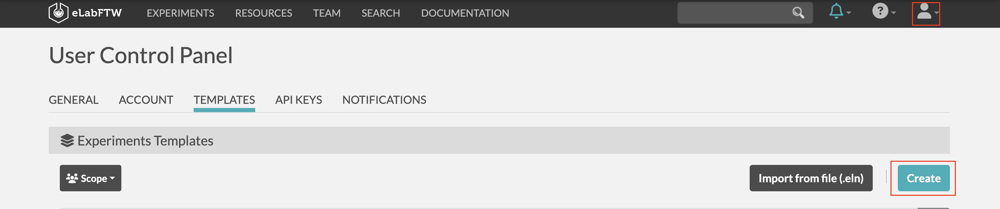
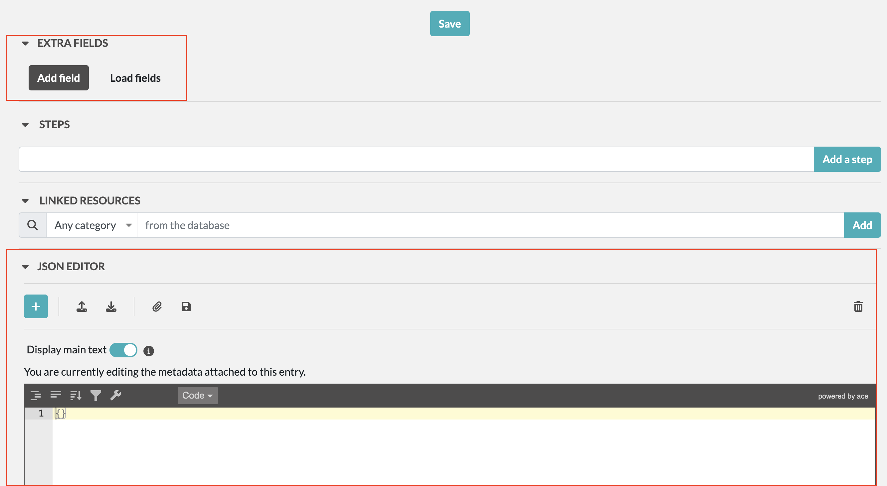

### Créer un modèle pour votre projet

1. Allez dans Profile > Templates > Create

2. Dans la page de création de template vous pouvez créer des champs via l'interface graphiuqe ou via le JSON EDITOR mis en place, selon vos préférences

