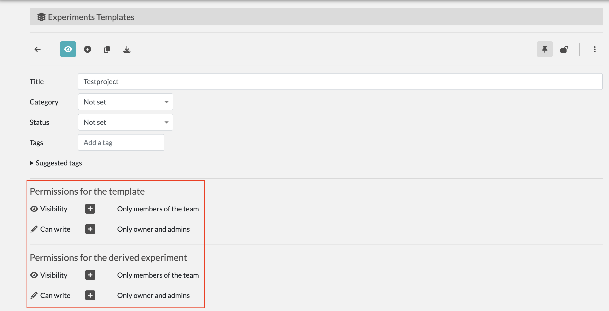
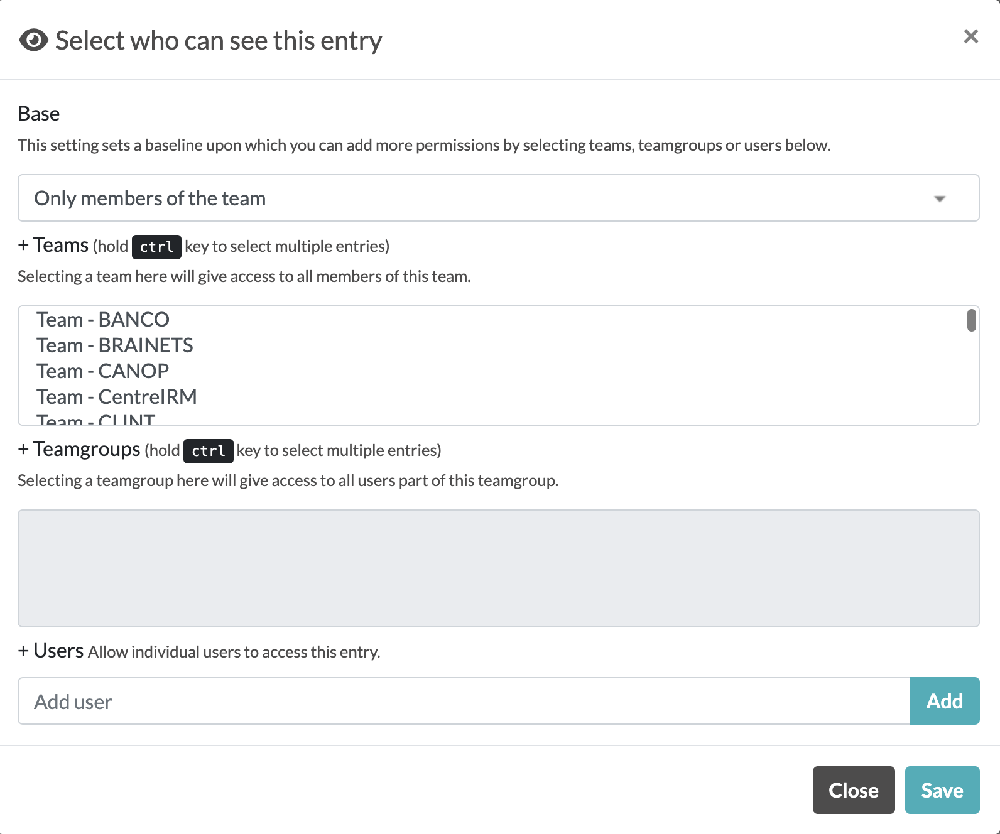

### Créer un modèle pour votre projet

1. Allez dans Profile > Templates > Create

2. Dans la page de création de template vous pouvez créer des champs via l'interface graphique ou via le JSON EDITOR mis en place, selon vos préférences

### Manager les doits de vue / d'écriture des templates

1. Vous pouvez manager les droits des personnes / équipes qui peuvent voir / modifier vos templates.

2. Cliquez sur le `+` afin d'avoir un menu plus détaillé de la gestion.

3. Ce menu vous permet de sélectionner : 
   - Des équipes particulières
   - Des groupes d'utilisateurs particuliers
   - Des utilisateurs particuliers

**Ce management est important** car il permet une bonne gestion entre les différentes équipes.
Un exemple: Un membre de l'équipe COMCO n'a pas besoin de voir ou de modifier un template de l'équipe NIT
