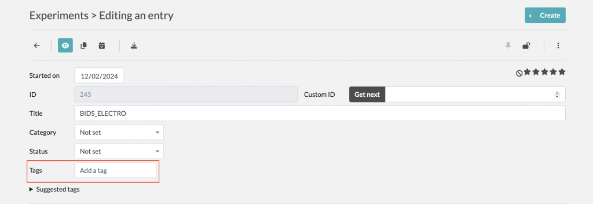
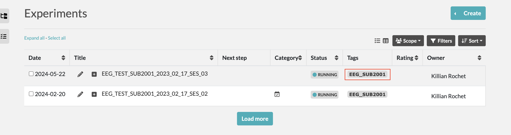

## Utiliser les tags

### Utilisation des tags sur eLabFTW

- Les tags permettent la gestions de vos expériences appartenant au même projet.
- Les tags vous permettrons aussi l'export des expériences du même projet (celles qui ont le même tag).
- Cela permet l'export de plusieurs expériences.

### Création des tags

1. La création des tags se fait dirrectement depuis la page de votre expérience.

2. Vos expériences possédant des tags apparaissent pas la suite comme ceci dans le menu principal

