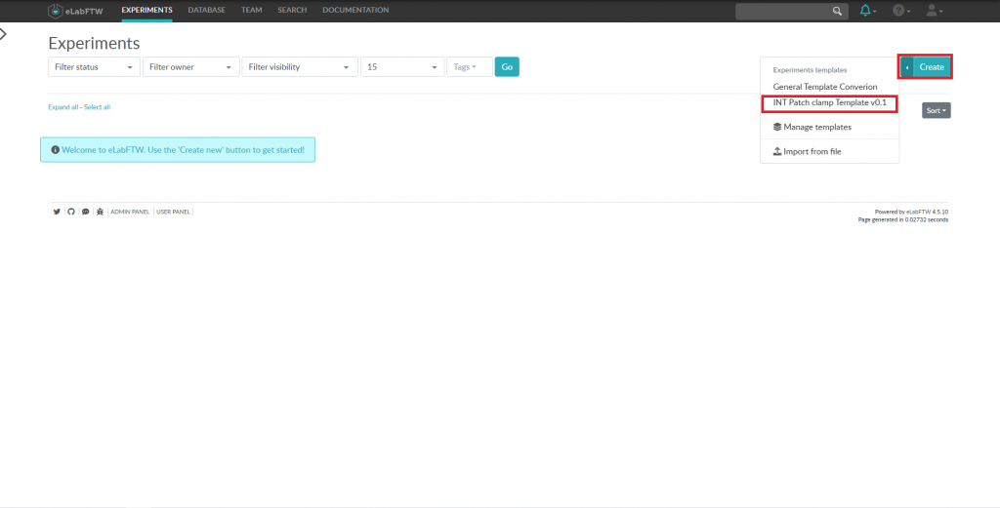
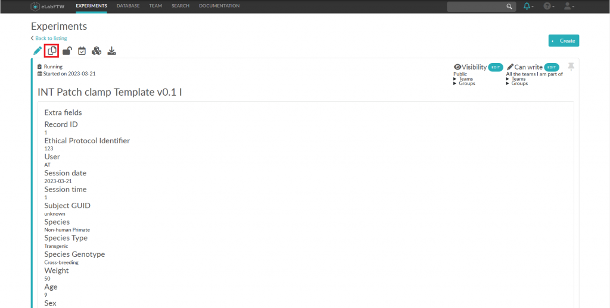
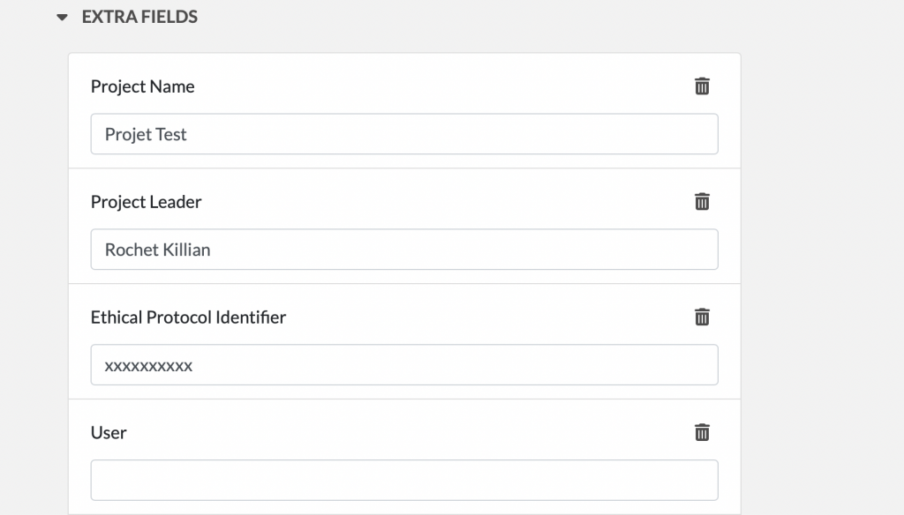

### Enregistrer une nouvelle expérience

1. Cliquez sur le menu Expériences et cliquez sur le menu d'options à côté de Créer.
2. Sélectionnez le modèle que vous avez défini à l'étape 6.

3. Vous pouvez commencer votre expérience
4. A la fin de l'expérience, sauvegarder l'expérience terminée

### Enregistrer une expérience avec des valeurs pré-remplies

1. Cliquez sur votre expérience précédente dans le menu des expériences d'Elab.
2. Juste en dessous du retour à la liste, cliquez sur l'icône de papier, à côté du crayon et du cadenas.

3. Vous êtes directement redirigé vers une nouvelle expérience dupliquée de la précédente avec les champs pré-remplis.

### Processus général d'enregistrement des données

1. Lorsque vous effectuez votre session d'acquisition de données, vous devez compléter les champs du formulaire

2. Chaque fois que vous saisissez une valeur dans un champ, votre expérience est automatiquement enregistrée.
3. Si l'acquisition des données dure plusieurs heures, vous pouvez laisser eLabFTW ouvert sur votre ordinateur.
4. Vous pouvez voir toutes vos expériences dans la section Expériences.
